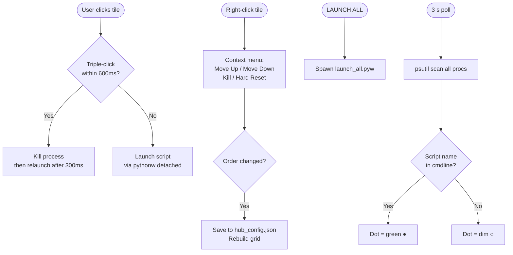
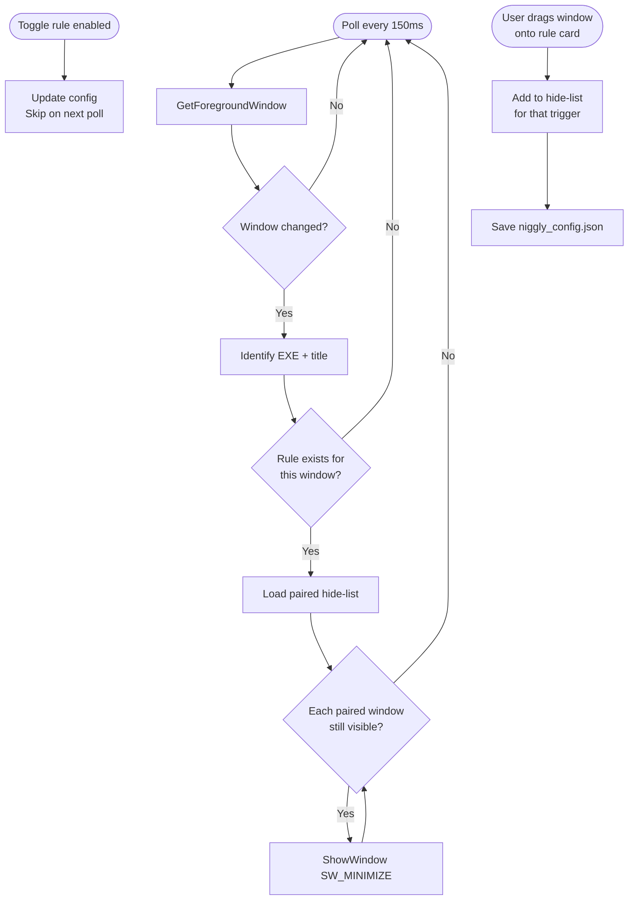
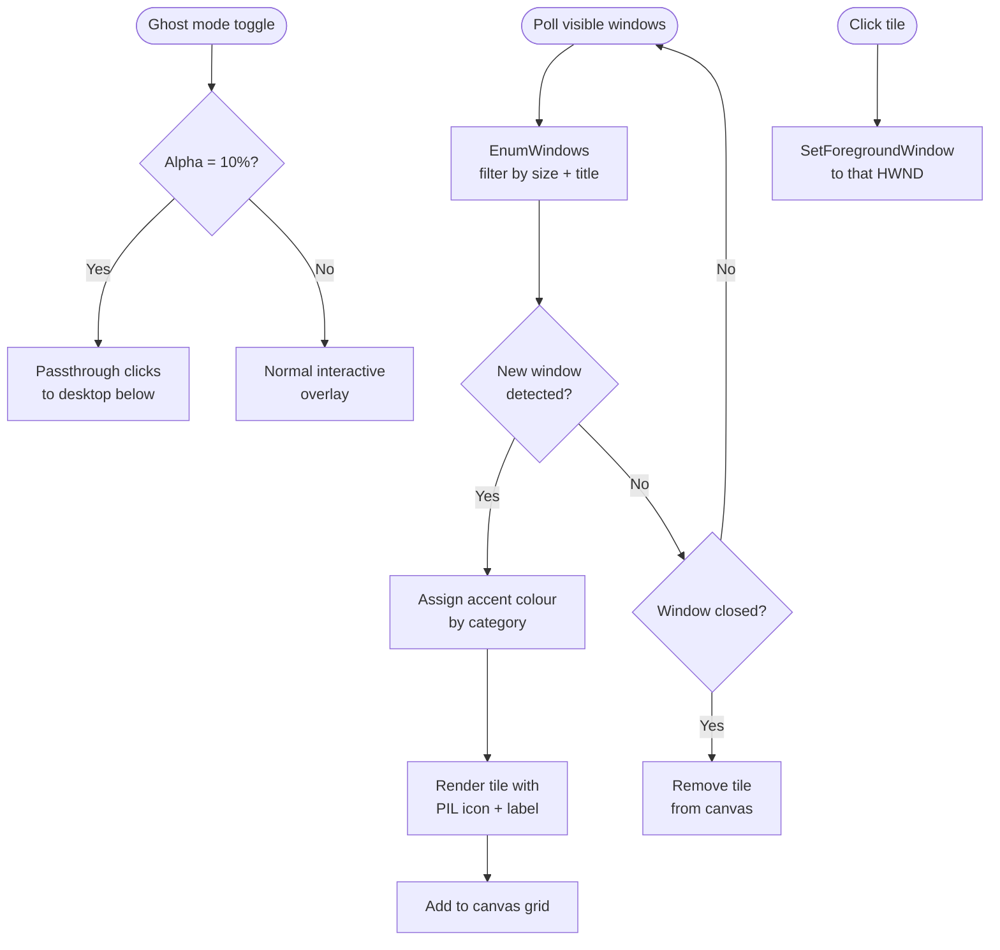
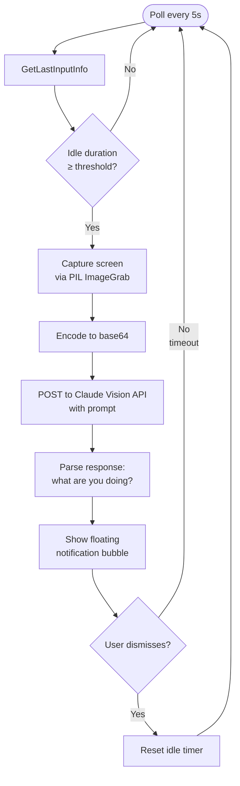
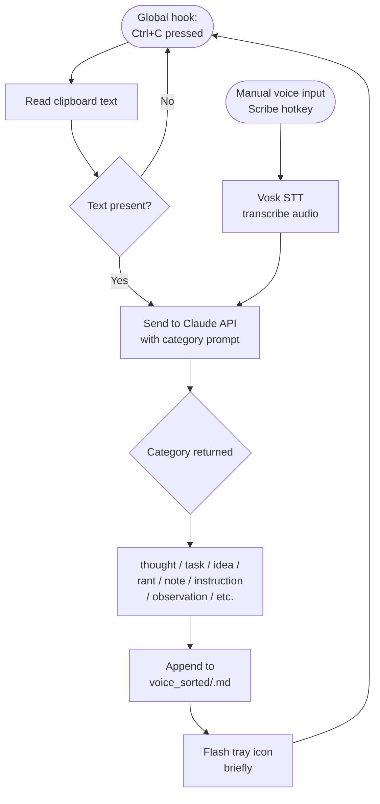
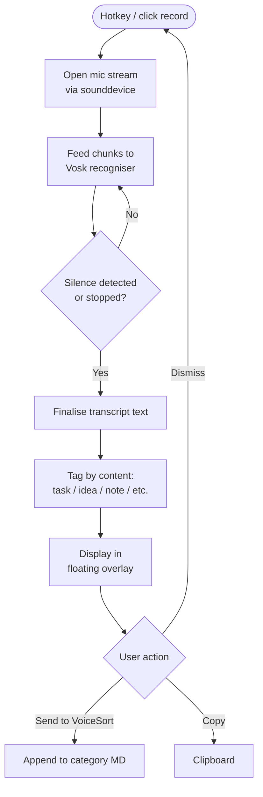
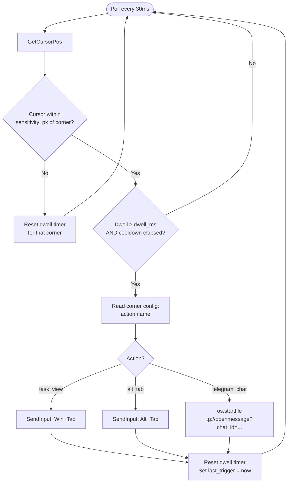
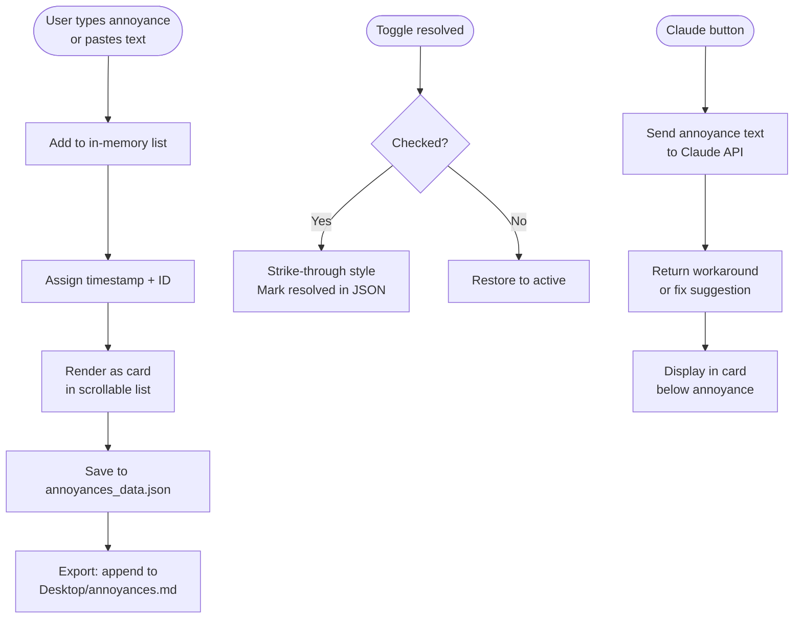
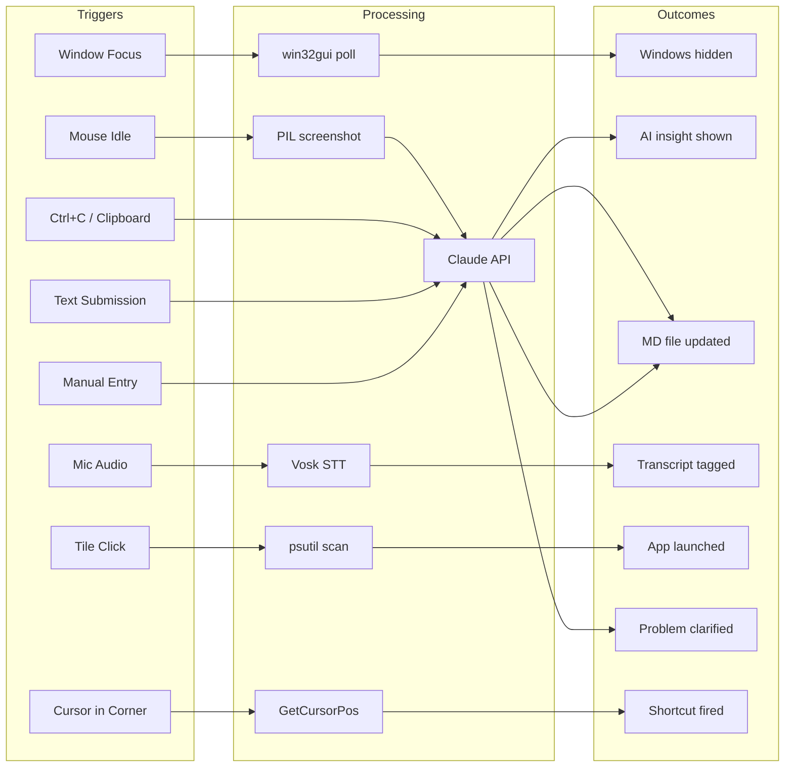

# Lawrence: Move In — If-Then-That Behaviour Map

Mermaid flowcharts documenting the trigger → condition → action chain for each applet.
Used as architectural context for the suite.

---

## hub.py — Master Hub



---

## niggly.py — Focus Rules (IFTTT Core)



---

## tiles.py — Window Tiles



---

## watcher.py — Idle Watcher



---

## voicesort.py — Voice Sort



---

## kidlin.py — Kidlin's Law

```mermaid
flowchart TD
    A([User types messy\nproblem in textbox]) --> B[Submit]
    B --> C[Send to Claude API:\n"Clarify what the actual problem is"]
    C --> D{API response}
    D --> E[Display clarified\nproblem statement]
    E --> F{User action}
    F -- Copy --> G[Clipboard copy]
    F -- Clear --> A
    F -- Save --> H[Append to\nkidlin_log.md]
```

---

## scribe.py — Floating Scribe



---

## hot_corner.py — Hot Corners



---

## annoyances.py — Annoyance Log



---

## Full Suite — If-Then-That Summary


