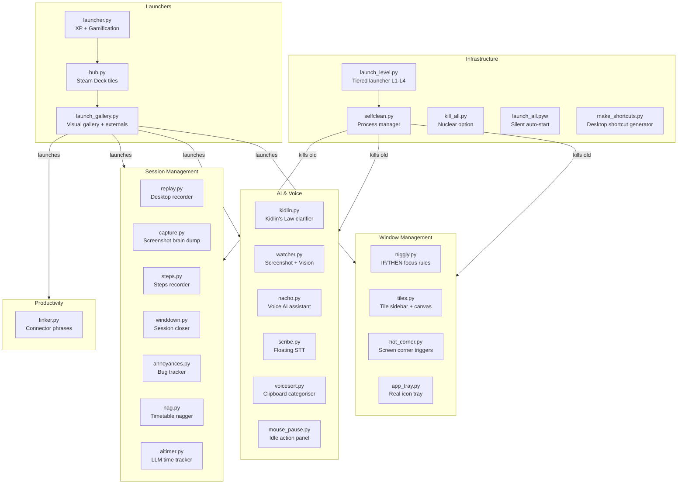
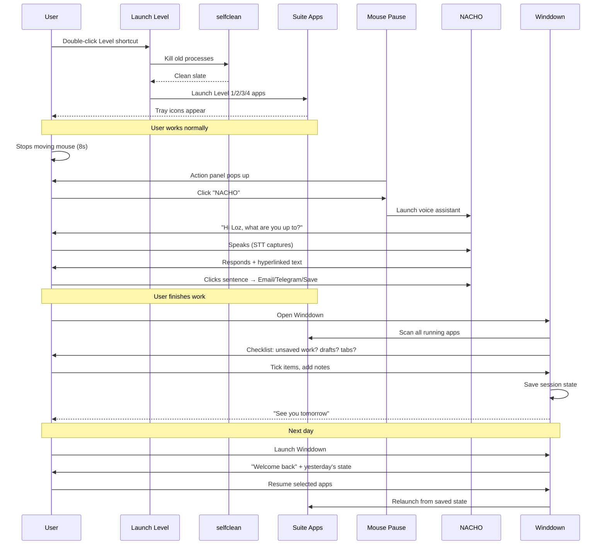
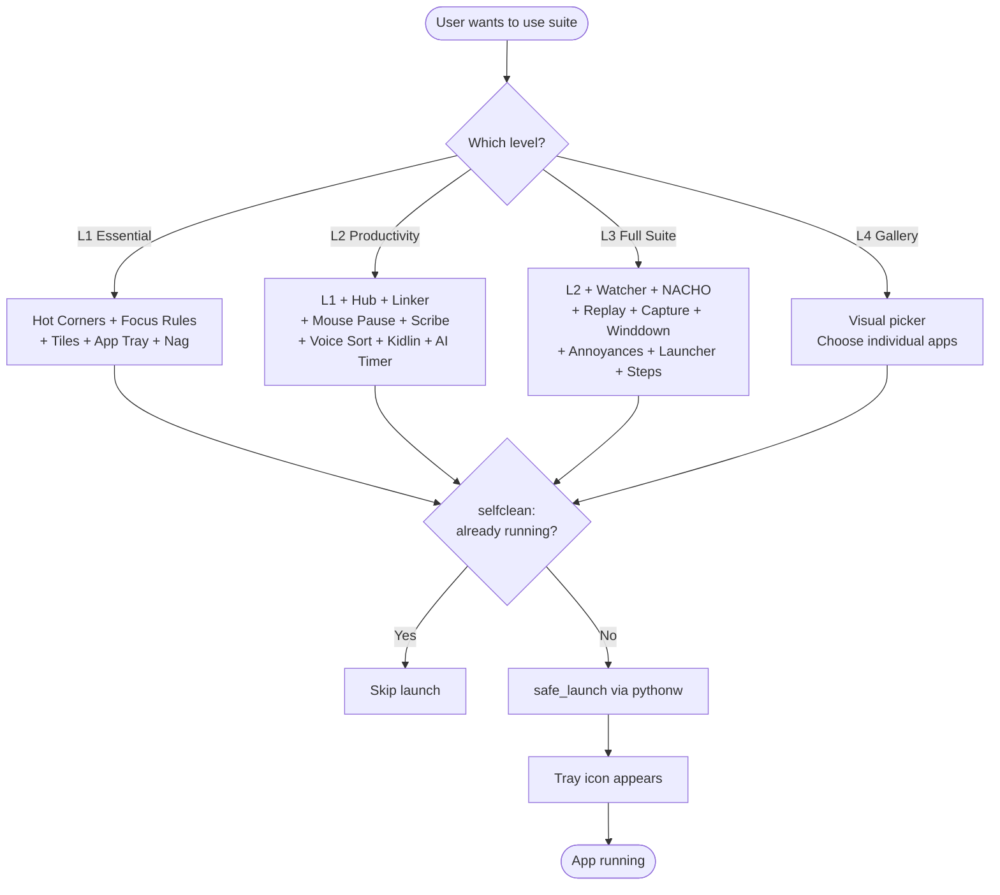
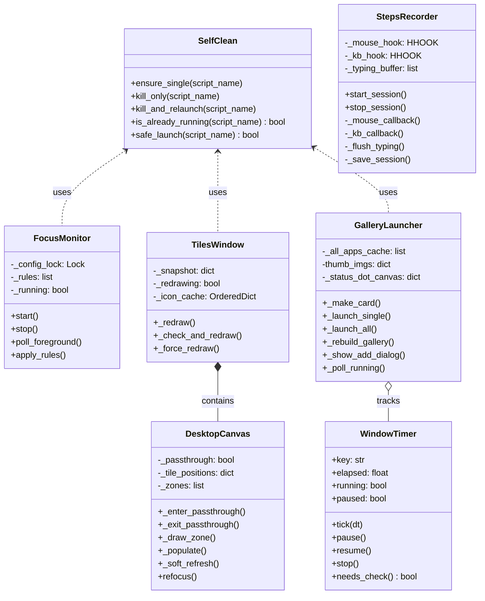
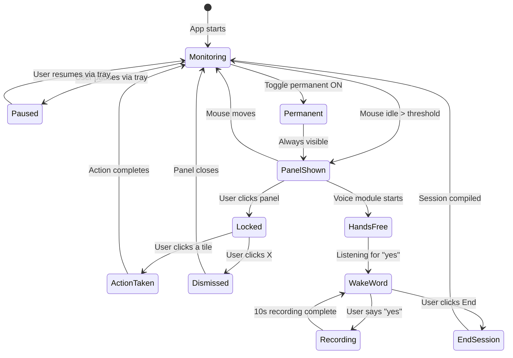
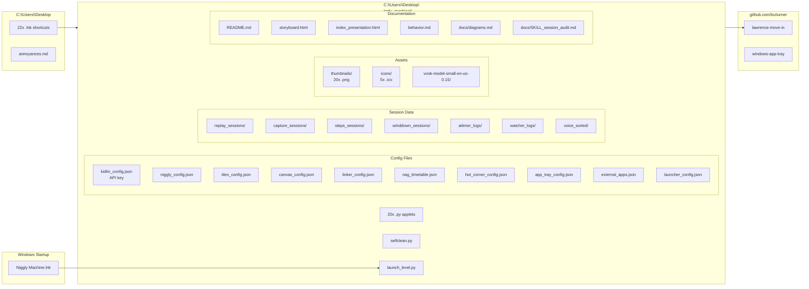
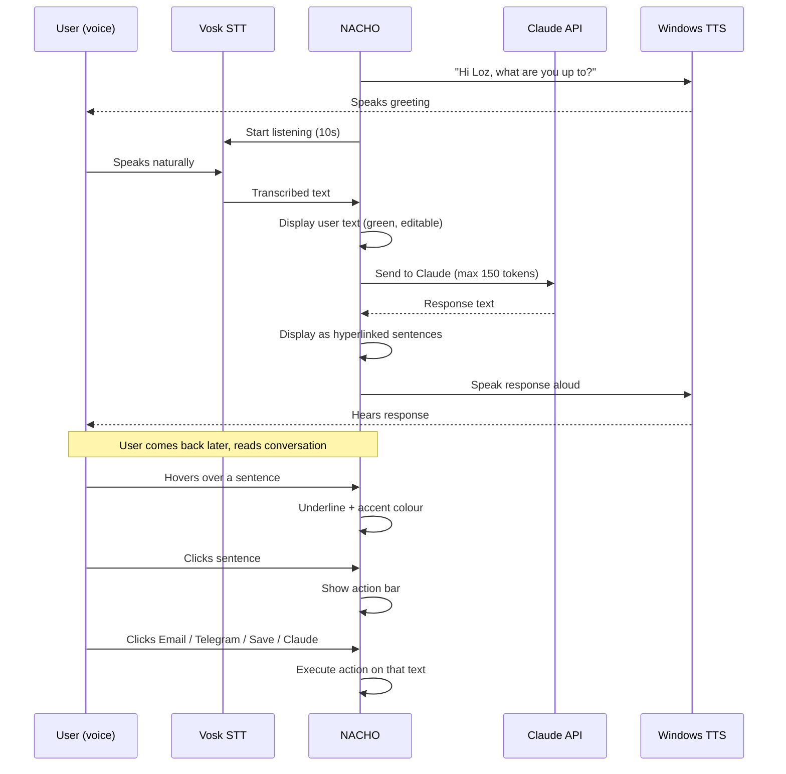

# Lawrence: Move In — Architecture Diagrams

Full visual documentation of the 20-applet Body Double suite.
17,000+ lines of Python. One developer. Zero committees.

---

## 1. Entity Relationship Diagram (ERD)

How data flows between apps and their config/storage files.

```mermaid
erDiagram
    LAUNCHER ||--o{ APPLET : "launches"
    LAUNCHER {
        json launcher_config
        int xp
        int level
        int total_launches
    }
    APPLET {
        string script_name
        string version
        string tray_icon
        bool running
    }
    HUB ||--o{ APPLET : "displays tiles"
    GALLERY ||--o{ APPLET : "shows cards"
    GALLERY ||--o{ EXTERNAL_APP : "includes"
    EXTERNAL_APP {
        string path
        string name
        string category
        png thumbnail
    }
    GALLERY }o--|| EXTERNAL_CONFIG : "reads/writes"
    EXTERNAL_CONFIG {
        json external_apps_json
    }
    NIGGLY ||--|| NIGGLY_CONFIG : "persists rules"
    NIGGLY_CONFIG {
        json niggly_config_json
        array rules
    }
    TILES ||--|| TILES_CONFIG : "persists layout"
    TILES ||--|| CANVAS_CONFIG : "persists positions"
    TILES_CONFIG {
        json tiles_config_json
        dict groups
        bool locked
    }
    CANVAS_CONFIG {
        json canvas_config_json
        dict positions
        array zones
    }
    VOICESORT ||--o{ SORTED_FILE : "writes to"
    SORTED_FILE {
        md category_file
        string tag
    }
    VOICESORT }o--|| LEARNED_TAGS : "learns from"
    LEARNED_TAGS {
        json learned_tags_json
    }
    REPLAY ||--o{ SESSION : "records"
    SESSION {
        json session_json
        md report_md
        dir screenshots
    }
    CAPTURE ||--o{ CAPTURE_SESSION : "bundles"
    CAPTURE_SESSION {
        json compiled_json
        md compiled_md
        jpg screenshots
    }
    STEPS ||--o{ STEPS_SESSION : "captures"
    STEPS_SESSION {
        json session_json
        md report_md
        jpg step_screenshots
    }
    WINDDOWN ||--o{ WINDDOWN_SESSION : "saves state"
    WINDDOWN_SESSION {
        json state_json
        md report_md
    }
    NAG ||--|| TIMETABLE : "reads schedule"
    TIMETABLE {
        json nag_timetable_json
        array tasks
    }
    ANNOYANCES ||--|| ANNOYANCES_DB : "persists"
    ANNOYANCES_DB {
        json annoyances_data_json
        md annoyances_md
    }
    KIDLIN }o--|| API_KEY : "calls Claude"
    WATCHER }o--|| API_KEY : "calls Claude Vision"
    NACHO }o--|| API_KEY : "calls Claude"
    VOICESORT }o--|| API_KEY : "calls Claude"
    API_KEY {
        json kidlin_config_json
        string sk_ant_key
    }
    SCRIBE }o--|| VOSK_MODEL : "transcribes"
    NACHO }o--|| VOSK_MODEL : "listens"
    MOUSE_PAUSE }o--|| VOSK_MODEL : "hands-free"
    VOSK_MODEL {
        dir vosk_model_folder
        string language_model
    }
    AITIMER ||--o{ TIMER_LOG : "exports"
    TIMER_LOG {
        md timer_log_md
    }
    LINKER ||--|| LINKER_CONFIG : "persists phrases"
    LINKER_CONFIG {
        json linker_config_json
        array categories
        array phrases
    }
    HOT_CORNER ||--|| CORNER_CONFIG : "reads corners"
    CORNER_CONFIG {
        json hot_corner_config_json
        dict corners
    }
    APP_TRAY ||--|| TRAY_CONFIG : "reads apps"
    TRAY_CONFIG {
        json app_tray_config_json
        array apps
        ico icon_files
    }
    SELFCLEAN ||--o{ APPLET : "kills old versions"
```

---

## 2. UML Component Diagram

How the suite is structured into logical components.

---

## 3. Sequence Diagram — User Session Lifecycle

From boot to wind-down.

---

## 4. Flowchart — App Launch Decision Tree

---

## 5. Class Diagram — Core Patterns

---

## 6. State Diagram — Mouse Pause Lifecycle

---

## 7. Deployment Diagram — File Layout

---

## 8. Conversation Flow — NACHO Voice Assistant

---

## Stats

| Metric | Value |
|--------|-------|
| Total applets | 20 |
| Lines of Python | 17,153 |
| Config files | 10 |
| Session data dirs | 7 |
| Desktop shortcuts | 22 |
| Mermaid diagrams | 8 |
| GitHub repos | 2 |
| Developer | 1 |
| Committees | 0 |
